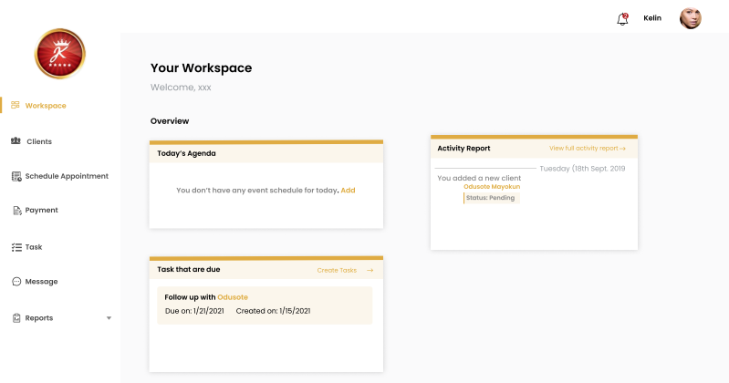

# Travel Manager Web Application

Hello, 👋 \
Travel Manager Web Application allows users to search for course of their choice and learn it within their vicinity. Travel Manager Web Application sort the issues of going to classes and stress for all the users.
```
Here's some notes about my submission:

1. A link to the project repository  https://github.com/olatunde1998/travel-manager-app

2. A publicly live hosted URL of the challenge https://travel-manager-app.vercel.app/

Thank you very much.

Best regards
Rasheed Olatunde

```
# Technologies 

 + [JavaScript](https://javascript.info/) 
 + [ReactJs](https://react.dev/) 
 + [NextJs](https://nextjs.org/)
 + [Vercel](https://vercel.com/dashboard) 
 + [Firebase](https://firebase.google.com/) 
 + [Github Actions](https://docs.github.com/en/actions/)
 + [React Hook-form](https://react-hook-form.com/) 
 + [TailwindCss](https://tailwindcss.com/) 
 + [Typescript](https://www.typescriptlang.org/) 


# Prototype

 
# How to Contribute

1. Clone the repository 
$ git clone [https://github.com/olatunde1998/travel-manager-app](https://github.com/olatunde1998/travel-manager-app)

2. Change directory into the cloned folder and run the setup script
$ cd online-learning-app

3. Open your terminal and type this command `yarn install ` or `npm install` to add the react dependency to the app in the development mode.

4. Then after the installation of the  dependency type this command  `yarn dev` to run the app in your local environment 

5. Copy this link [http://localhost:3000/](http://localhost:3000/) and paste it to your web browser(Chrome, safari, mozilla firefox et.c) to view it.


# Deployment
Vercel was used to deploy the app. 
 + [Vercel](https://vercel.com/dashboard)

# License
The MIT License - Copyright (c) 2023 - Present, geodevcode/  Storage Service.

# Author
Rasheed Olatunde (Frontend Developer)